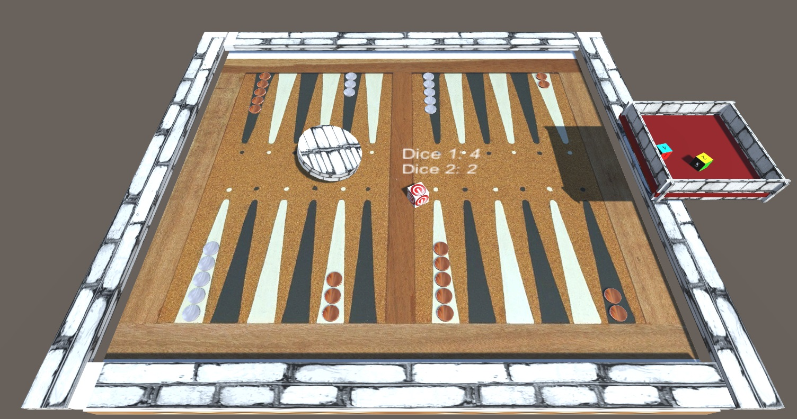

# shablool-sheshbesh

**אזהרה - משחק ממכר**
https://to-gaming.itch.io/shablul-backgammon (Beta)
  
#  Scenes Prefabs and Scripts:
  
  ## Scenes:
  Lobby - in the lobby the player can choose if he wants to start or to do the tutorial (not implemented yet). 
  SampleScene (Main Game) - the main scene of the game. 
  Tutorial - in this scene the player is about to understand the rules of Shablul-Sheshbesh. 
  
  ## Prefabs:
  WhitePiece - represents one white soldier (Dragable) . 
  CustomTile - the editor can configure the contents of each Tile. 
  GroupTiles - a prefab that holds 6 Customizable Tiles next to each other (4 pieces in game board)   
  Dice (toQuit) - in Game option to exit to Lobby . 
  Dice (toStart) - in Game option to Start the Game. 
  Dice (toRoll) - grey cylinder Object to trigger Roll . 
  
  ## Scripts and effects:
  AddRemove.cs - Makes every Tile (24 tiles in game) be able to instanciate 'Soldiers'(Black or White) along the Tile. 
  DragObject.cs - makes evry 'soldier' moveable by calculating x and z from mouse to soldier. 
  DiceResults.cs - Sets new Dice values (and shake the dices) , visable on screen. 
  Dice (Physics material) - bounciness to the required objects.
## מהות המשחק

 שבלול שש בש זה משחק אשר מאפשר חוויה הרבה יותר אינטנסיבית כי מדובר בגרסא שונה לחלוטין שמציעה למשתמש גם אופציות שונות תוך כדי המשחק, המשחק עצמו הוא מתחיל כמו שש בש אבל כאשר אתה הורג חייל של האויב הוא יוצא מהמשחק, ואתה מקבל על זה קרדיט, או כאשר השחקן מתקדם ועובר את ה"מעבר להתחלה", ואז בקרדיט שהרוויח יכול לרכוש "קלף כוח" שאיתו יוכל להשפיע על המשחק.
המשחק מיועד לפלאפון או לאינטרנט

 
 
 

---
## ScreenShots
 

## רכיבים רשמיים

### 1. שחקנים

* המשחק מיועד לילדים ומעלה, ובעיקר אך לא בהכרח לשחקני שש בש
* במשחק 2 משתתפים אך ניתן יהיה לשחק ברשת נגד אנשים שונים או באותו מכשיר
* משחק תחרותי, הטוב ביותר ינצח

### 2. יעדים

* היעד במשחק הוא להרוג את כל חייליו של היריב עד לסיום המשחק
* בתחילת המשחק יהיה הסבר פשוט אשר ינחה את השחקן שעליו להרוג כמה שיותר חיילים ויקבל חיזוק עם אופצית מימוש במידה והצליח 
* אמנם יש יעד בודד אבל שחקן יוכל לסיים את המשחק בעזרת אסטרטגיה של התקדמות מהירה של חילים
 
### 3. תהליכים

* השחקן שנכנס למשחק רואה תמונות וחלקים מ"יכולות העל" שהמשחק מציע, נראה כאילו הולך לשחק שש בש אך סקרן לדעת איך יוכל לבטא את כישורי המשחק שלו במשחק שהוא שונה במהותו  
*	התהליך המרכזי הוא להתקדם בעזרת הקוביות תוך כדי בניית בתים מבלי להיות מותקף על ידי היריב הבעיה היא שחוץ מקוביות, עוד אלמנט שקשור במזל במשחק הוא קלפי כוח שונים שיכול לממש אותם במשחק וישפיעו על הקרב. 
 (לדוגמא קלף קוביות מזל - ולקבל אופציה גבוהה לדאבל, קלף יכולת הריסת בית בגודל 2, קלף הגנה עבור ניסיון אחד של האויב להתקפה, קלף רוח שבוחר 3 חיילים וממקם אותם בצורה אקראית מחדש)
*	סיום המשחק ייקבע לפי השחקן שיצליח להותיר לאויב 3 חיילים בלבד או שהמשחק הגיע לסוף הזמן ויחושב למי יש יותר חיילים
* יהיה שימוש בעיקר במגע בשביל להחליט איך להזיז את החיילים, ועיון בחנות יתבצע גם כך

השחקן מתחיל לשחק משחק שהוא מכיר, ומקבל הדרכה תוך כדי וגם פידבק טוב על הריגת חיילי האויב, עד שמתרגל ומייצר לעצמו אסטרטגיות חדשות תואמות ומתקדם עם הקלפים המיוחדים והשונים 

### 4. חוקים

* ניתן לכל שחקן זריקת קוביות אחת, תוצאת הקוביות תחליט איך יוכל להתקדם
* במידה ושחקן מתקדם לעבר חייל ללא בית יוכל להוציאו מהמשחק
* החוקים יתוארו במשחק הראשון של השחקן

### 5. משאבים

  
  
 
* (1)המשאבים במשחק הם המטבעות-שבלול שהשחקן יצבור בהריגת חייל(2) , ובנוסף קרדיט עבור מעברים ב"שער" אל עבר תחילת המגרש
* ניתן להחליף מטבעות שבלול ביכולות בחנות המשחק שיעזרו למתמודד לנצח
 * בנוסף ניתן להחליף מטבעות עבור קלפי כוח 
 * איך השחקן יוכל להשיג משאבים?
 * הריגת חיילים מסויימים יביאו לך 2 מטבעות שבלול
 * במעבר של החיילים מסוף המגרש לתחילתו נצברים מטבעות
* ברגע ששחקן מגיע למעברים הוא יקבל הודעה רשמית ויפה על קבלת המטבע, ובמידה ויש לו מספיק לרכישה יקבל עצה איך יוכל להשתמש בהם

  
 
### 6. עימותים

מה יהיו העימותים המרכזיים במשחק:

* יש עימות מרכזי בין שני המשתתפים, שבו הם מנסים להתגונן על ידי יצירת בתים והתקדמות עם נסיון לכמה שפחות סיכונים, עד שהמזל מתערב
* דילמה שקיימת במהלך המשחק בין השחקן לעצמו היא אופציות ההגנה השונות, ובנוסף בגרסאת הארקייד יש אופציה עבור השחקן להחליט איך משקיע את הנקודות שלו בכדי להלחם באויב

### 7. גבולות
זהו משחק קופסא ולכן משחקים בתוכו בתסנית מוכרת.
גבולות המשחק הם כמו שש בש, רק שמותר להתקדם חופשי מסוף המגרש לתחילתו עבור כל שחקן וכיוון המשחק שלו.

### 8. תוצאות

התוצאות האפשריות הן נצחון שלך או של היריב, או לחלופין תיקו במקרה שהמשחק הגיע לסופו בזמן שכמות החיילים של שני המשתתפים זהה 
* המשחק בדומה לשש בש מורכב גם ממזל וגם מטכניקה, על מנת לנצח מסל לא יספיק לכם, ובנוסף ללא מזל ואך ורק בעזרת תכנון טוב אפשר להגיע לנצחון 
* האם המשחק יהיה "סכום אפס", שיתופי, או מורכב?

---

## סקר שוק

 למשחק אין מתחרים שמציעים משחק שש בש ארקייד בעל תכונות שונות ומגוונות, אלא רק גרסאות קיימות מהעולם של המשחק הקלאסי שש בש
 
 1. Backgammon Games : 18
 *https://play.google.com/store/apps/details?id=com.tavla5
  
 
 2. Backgammon - Lord of the Board
 * משחק שש בש קלאסי עם הימורים על כסף, משחק שונה לגמריי ולא ייחודי
 * https://play.google.com/store/apps/details?id=air.com.beachbumgammon
 
 
 
 
 3.PlayGem Backgammon
 * המשחק עובד בלייב אבל הוא מציע משחק רגיל של שש בש
 * https://play.google.com/store/apps/details?id=playgem.backgammon
 
 
 
לפני שמתחילים לעבוד על משחק (או כל מוצר אחר), חשוב לוודא שלא עשו את זה קודם. לא נעים לעבוד סמסטר שלם (או שנה שלמה) על משחק ואז לגלות שכבר יש משחק כזה. 

חפשו בגוגל, בחנות play, בפייסבוק, ובכל מקום אחר שיש לכם גישה אליו, משחקים דומים לרעיון שלכם. ציינו באיזה ביטויי-חיפוש השתמשתם.

זהו את שלושת המשחקים הדומים ביותר. לגבי כל אחד מהם:

* שימו קישור וצילום-מסך להמחשה.
* הסבירו מה תעשו כדי שהמשחק שלכם יהיה שונה/מקורי/מיוחד/טוב יותר מהמתחרים?  מדוע שחקנים יעדיפו דווקא את המשחק שלכם?

מבין הרכיבים הרשמיים, 
איזה רכיב (או רכיבים) ידגיש ביותר את הייחוד והמקוריות של המשחק שלכם, לעומת משחקים דומים הקיימים בשוק?

